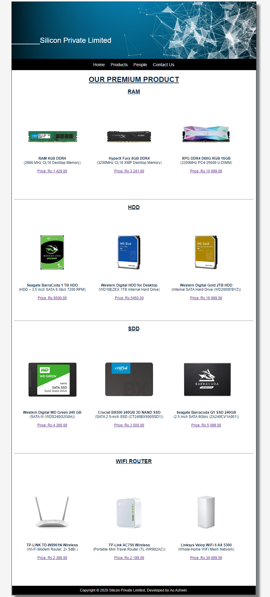
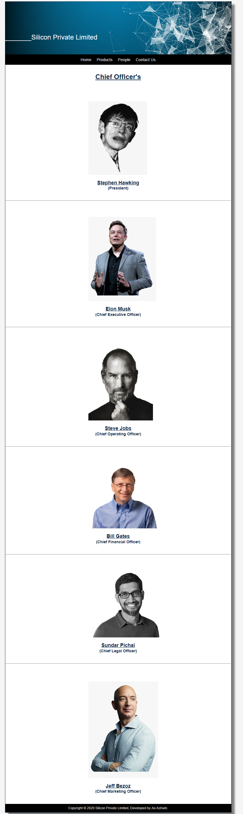
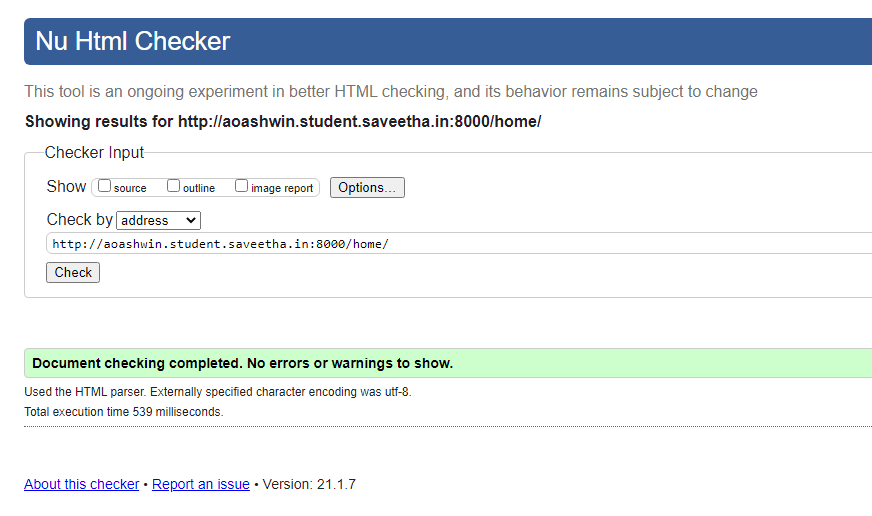
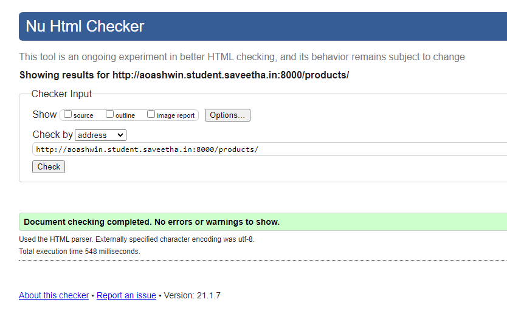
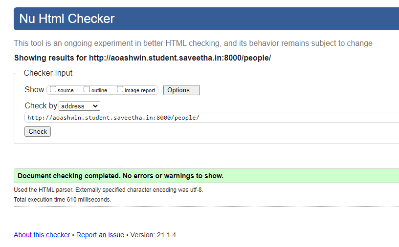
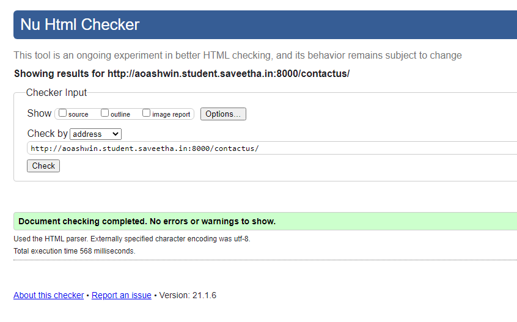

# Web Design for a Manufacturing Company
## AIM: 
To design a static website for a chip manufacturing company.

## DESIGN STEPS:
### Step 1: 
Requirement collection.
### Step 2:
Creating the layout using HTML and CSS.
### Step 3:
Updating the sample content.
### Step 4:
Choose the appropriate style and color scheme.
### Step 5:
Validate the layout in various browsers.
### Step 6:
Validate the HTML code.
### Step 6:
Publish the website in the given URL.

## PROGRAM:

### base.html
```

<!DOCTYPE html>
<html lang="en">

<head>
    <title>Silicon Private Limited</title>
    <link rel="stylesheet" href="">
    <link rel = "icon" href ="" type = "image/x-icon"> 
              
</head>

<body>
    <div class="container">
    <div class="banner">
        _______Silicon Private Limited
    </div>
    <div class="menu">
        <div class="menuitem"><a href="/home">Home</a></div> 
        <div class="menuitem"><a href="/products">Products</a></div> 
        <div class="menuitem"><a href="/people">People</a></div>
        <div class="menuitem"><a href="/contactus">Contact Us</a></div> 
    </div><div class="content">
        
    
    </div>
    <div class="footer">
        Copyright © 2020 Silicon Private Limited, Developed by Ao Ashwin.
    </div>
    </div>
</body>

</html>
```
### home.html
```



    <div class="homecontent">    
    <h1>About Us</h1>
    
    <div class="contenttext">
    Silicon Pvt Ltd, provides a broad range of semiconductor and infrastructure software applications that serve the data center, networking, software, broadband, wireless, and storage and industrial markets. Common applications for its products include: data center networking, home connectivity, broadband access, telecommunications equipment, smartphones, base stations, data center servers and storage, factory automation, power generation and alternative energy systems, displays, and mainframe operations and management, and application software development. Some of Silicon's core technologies and products include:
    <ul>
        <li>Memory Chips</li>
        <li>SATA HDD</li>
        <li>SATA SSD </li>
        <li>Broadband Modems</li>
        <li>Wifi Devices</li>
        <li>Switching Devices</li>
        <li>Optical Sensors</li>
    </ul> 
    </div>
    </div>


```
### products.html
```



    <div class="productcontent">    
    <h1>OUR PREMIUM PRODUCT</h1>
    <h2 class="producthead">RAM</h2>
    <div class="productitems">
        <div class="productitem"> 
            <div class="itemimage">
            
            </div>
            <div class="itemname"><b> RAM 4GB DDR4</b> </br>
                (2666 MHz CL19 Desktop Memory)</div>
            <div class="itemprice"><a href="https://www.amazon.in/Crucial-4gb-ddr4-2666-Desktop/dp/B07GMRJTS9/ref=sr_1_5?dchild=1&keywords=ram&qid=1610077354&s=computers&sr=1-5">Price: Rs.1,429.00 </a></div>
        </div>
        <div class="productitem">
            <div class="itemimage">
                
            </div>
            <div class="itemname"><b>HyperX Fury 8GB DDR4</b></br>(3200MHz CL16 XMP Desktop Memory) </div>
            <div class="itemprice"><a href="https://www.amazon.in/HyperX-3200MHz-Desktop-Memory-HX432C16FB3/dp/B07WJJ9CNG/ref=sr_1_3?dchild=1&keywords=ram&qid=1610077354&s=computers&sr=1-3">Price: Rs.3,241.00</a></div>
        </div>
        <div class="productitem">
            <div class="itemimage">
                
            </div>
            <div class="itemname"><b>XPG DDR4 D60G RGB 16GB</b></br>(3200MHz PC4-25600 U-DIMM) </div>
            <div class="itemprice"><a href="https://www.amazon.in/XPG-3200MHz-PC4-25600-CL16-20-20-AX4U320038G16A-DW60/dp/B0828CSTWC/ref=sr_1_2_sspa?dchild=1&keywords=ram&qid=1610094328&s=computers&sr=1-2">Price: Rs.10,999.00</a></div>
        </div>
    </div>
    <hr>
    <h2 class="producthead">HDD</h2>
    <div class="productitems">
        <div class="productitem"> 
            <div class="itemimage">
            
            </div>
            <div class="itemname"><b>Seagate BarraCuda 1 TB HDD</b></br>(HDD – 3.5 Inch SATA 6 Gb/s 7200 RPM) </div>
            <div class="itemprice"><a href="https://www.amazon.in/Seagate-BarraCuda-ST1000DM010-Desktop-Latest/dp/B01LNJBA2I/ref=sr_1_2?dchild=1&keywords=hdd&qid=1610088209&s=computers&sr=1-2">Price: Rs.6500.00</a></div>
        </div>
        <div class="productitem">
            <div class="itemimage">
                
            </div>
            <div class="itemname"><b>Western Digital HDD for Desktop</b></br> (WD10EZEX 1TB Internal Hard Drive) </div>
            <div class="itemprice"><a href="https://www.amazon.in/Western-Digital-WD10EZEX-Internal-Desktop/dp/B0088PUEPK/ref=sr_1_1?dchild=1&keywords=Western+Digital+Blue+1TB&psr=EY17&qid=1610099690&s=todays-deals&sr=1-1">Price: Rs.5450.00</a></div>
        </div>
        <div class="productitem">
            <div class="itemimage">
                
            </div>
            <div class="itemname"><b>Western Digital Gold 2TB HDD</b></br> (Internal SATA Hard Drive (WD2005FBYZ)) </div>
            <div class="itemprice"><a href="https://www.amazon.in/Western-Digital-Internal-Drive-WD2005FBYZ/dp/B01IY9UTMM/ref=sr_1_1?crid=1FMIGIV7SISBB&dchild=1&keywords=western+digital+hard+disk+gold&qid=1610100444&s=computers&sprefix=wes%2Ccomputers%2C369&sr=1-1">Price: Rs.16,999.00</a></div>
        </div>
    </div>
    <hr>
    <h2 class="producthead">SDD</h2>
    <div class="productitems">    
        <div class="productitem">
            <div class="itemimage">
                
            </div>
            <div class="itemname"><b>Western Digital WD Green 240 GB</b></br> (SATA III (WDS240G2G0A)) </div>
            <div class="itemprice"><a href="https://www.amazon.in/Western-Digital-WDS240G2G0A-240GB-Internal/dp/B076Y374ZH/ref=sr_1_1?dchild=1&keywords=sdd&qid=1610100140&s=computers&sr=1-1">Price: Rs.4,300.00</a></div>
        </div>
        <div class="productitem">
            <div class="itemimage">
                
            </div>
            <div class="itemname"><b>Crucial BX500 240GB 3D NAND SSD</b></br> (SATA 2.5-inch SSD (CT240BX500SSD1)) </div>
            <div class="itemprice"><a href="https://www.amazon.in/Crucial-BX500-240GB-2-5-inch-CT240BX500SSD1/dp/B07G3YNLJB/ref=sr_1_2?dchild=1&keywords=sdd&qid=1610100913&s=computers&sr=1-2">Price: Rs.3,500.00</a></div>
        </div>
        <div class="productitem">
            <div class="itemimage">
                
            </div>
            <div class="itemname"><b>Seagate Barracuda Q1 SSD 240GB</b></br> (2.5 Inch SATA 6Gb/s (ZA240CV1A001)) </div>
            <div class="itemprice"><a href="https://www.amazon.in/Seagate-Barracuda-240GB-Internal-Solid/dp/B08FJB98F1/ref=pd_sbs_147_3/259-4979351-0376003?_encoding=UTF8&pd_rd_i=B08FJB98F1&pd_rd_r=b0bac50d-3">Price: Rs.5,099.00</a></div>
        </div>
    </div>
    <hr>
    <h2 class="producthead">WIFI ROUTER</h2>
    <div class="productitems">
        <div class="productitem">
            <div class="itemimage">
                
            </div>
            <div class="itemname"><b>TP-LINK TD-W8961N Wireless</b></br> (Wi-Fi Modem Router, 2x 5dBi ) </div>
            <div class="itemprice"><a href="https://www.amazon.in/TP-LINK-TD-W8961N-300Mbps-Antenna-Wireless/dp/B00RK5VU5M/ref=sr_1_2_sspa?crid=11RANSQBZB0TM&dchild=1&keywords=wifi+modem&qid=1610102045&s">Price: Rs.2,399.00</a></div>
        </div>
        <div class="productitem">
            <div class="itemimage">
                
            </div>
            <div class="itemname"><b>TP-Link AC750 Wireless</b></br> (Portable Mini Travel Router (TL-WR902AC)) </div>
            <div class="itemprice"><a href="https://www.amazon.in/TP-Link-TL-WR902AC-Wireless-Travel-Router/dp/B01N5RCZQH/ref=sr_1_15_sspa?crid=11RANSQBZB0TM&dchild=1&keywords=wifi+modem&qid=1610102045&s">Price: Rs.2,199.00</a></div>
        </div>
        <div class="productitem">
            <div class="itemimage">
                
            </div>
            <div class="itemname"><b>Linksys Velop WiFi 6 AX 5300</b></br> (Whole-Home WiFi Mesh Network) </div>
            <div class="itemprice"><a href="https://www.amazon.in/dp/B07Z5NZ9CQ/ref=sspa_dk_detail_7?psc=1&pd_rd_i=B07Z5NZ9CQ&pd_rd_w=s4RPI&pf_rd_p=1801b34c-8af9-42b5-8961-11f124edc99b&pd_rd">Price: Rs.39,999.00</a></div>
        </div>
    </div>

```
### people.html
```



    <div class="peoplecontent">
        <h1>Chief Officer's</h1>
    </div>
    <div class="peoplelists">
        <div class="peoplelist">
            <div class="peopleimage">
                
            </div>
            <div class="peoplename"><h2>Stephen Hawking</h2></div>
            <div class="peoplepost"><h3>(President)</h3></div>
        </div>
    </div>
    <div>
        <hr>
    </div>
    <div class="peoplelists">
        <div class="peoplelist">
            <div class="peopleimage">
                
            </div>
            <div class="peoplename"><h2>Elon Musk</h2></div>
            <div class="peoplepost"><h3>(Chief Executive Officer)</h3></div>
        </div>
    </div>
    <div>
        <hr>
    </div>
    <div class="peoplelists">
        <div class="peoplelist">
            <div class="peopleimage">
                
            </div>
            <div class="peoplename"><h2>Steve Jobs</h2></div>
            <div class="peoplepost"><h3>(Chief Operating Officer)</h3></div>
        </div>
    </div>
    <div>
        <hr>
    </div>
    <div class="peoplelists">
        <div class="peoplelist">
            <div class="peopleimage">
                
            </div>
            <div class="peoplename"><h2>Bill Gates</h2></div>
            <div class="peoplepost"><h3>(Chief Financial Officer)</h3></div>
        </div>
    </div>
    <div>
        <hr>
    </div>
    <div class="peoplelists">
        <div class="peoplelist">
            <div class="peopleimage">
                
            </div>
            <div class="peoplename"><h2>Sundar Pichai</h2></div>
            <div class="peoplepost"><h3>(Chief Legal Officer)</h3></div>
        </div>
    </div>
    <div>
        <hr>
    </div>
    <div class="peoplelists">
        <div class="peoplelist">
            <div class="peopleimage">
                
            </div>
            <div class="peoplename"><h2>Jeff Bezoz</h2></div>
            <div class="peoplepost"><h3>(Chief Marketing Officer)</h3></div>
        </div>
    </div>

```
### contactus.html
```



    <div class="contactuscontent">
        <div class="contactbox">
            <div>
                
            </div>
        </div>
        <hr/>
        <div class="contactemail"><h1>Email: aosiliconcompany@gmail.com</h1></div>
        <div class="contactphone"><h2>Phone: +91-9159425427</h2></div>
        <hr/>
    </div>


```
## OUTPUT:







## CODE VALIDATION REPORT:







## RESULT:
Thus a website is designed for the chip manufacturing company and is hosted in the URL http://aoashwin.student.saveetha.in:8000/. HTML code is validated.